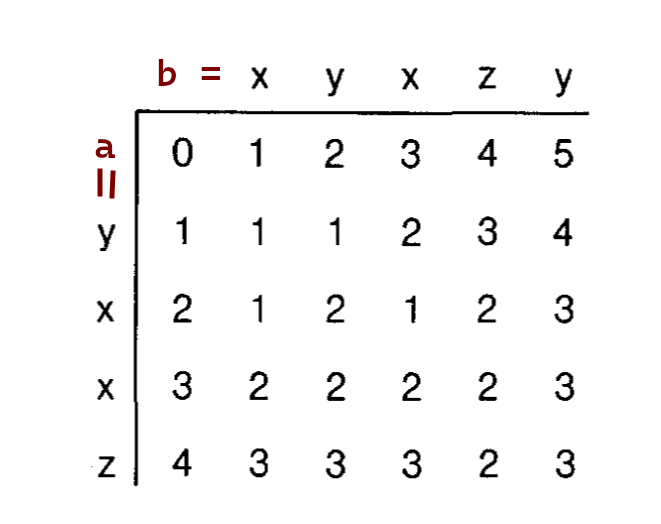
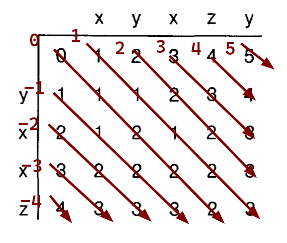

# Edit Distance Wavefront

## The ED Problem

Let $a$ be a string of length $m$ which is indexed $a = (a_{1}, ..., a_{i}, ..., a_{m})$.

Let $b$ be a string of length $n$ which is indexed $b = (b_{1}, ..., b_{j}, ..., b_{n})$.

For example, $a = yxxz$ and $b = xyxzy$.

Let $M$ be the matrix $(m + 1) \times (n + 1)$ so that $\forall i \in [0, m],j \in [0,n] \; M[i,j] = ED(a[:i], b[:j])$.
In other words, M is the matrix of the unweighted edit distance.

The matrix M has $m + n - 1$ diagonals, indexed in the range $[-m, n]$. The *0-th* diagonal is the "main" diagonal.
Therefore, the diagonals of $M$ are indexed as such:

## The Wavefront Matrix

Let $W$ be the matrix $K \times (P + 1)$ where $K$ is the number of diagonals and $P$ is a positive number representing the upper bound of ED value.

Then $\forall k \in [-m,n],p \in [0,P] \; | \; W[k,p] = i$ where $i$ is the largest row index in $M$ such that $M[i,i+k] = p$. Said otherwise, is the largest row index in which a value lying on the diagonal $k$ is equal to $p$.

The index $i$ is often called the $wavefront$ or the $frontier$ of the diagonal with respect to value $p$. It represents the last (largest) value of $i$ so that $D[i,j] \leq p$.

Note that strict equality is needed by the definition of $W[k,p]$, so if a value $p^{I}$ is not contained in the *k-th* diagonal, the value of $W[k,p]$ is $NaN$ (undefined).

Moreover, by definition, the (defined, $\neq NaN$) values of $W[k,p]$ (for a fixed $k$) are a strictly increasing sequence.

Finally, by definition, for $p < |k|$ the value of $W[k,p]$ is $NaN$, or said otherwise, the value of $W[k,p]$ is defined if-and-only-if $p >= |k|$.

## ED Matrix from Wavefront Matrix

If you want to reconstruct $M[i,j]$ from $W[k,p]$ it is sufficient $\forall i \in [0,m],j \in [0,n]$ to find the value $p$ for which $W[k,(p-1)] < i \leq W[k,p]$. A linear scan is sufficient, but of course you can cache the previous $p$ for that column so that you start searching from $p+1$.

## Constructing the Wavefront Matrix

### Definitions

- I define $MinD = max(-m, -P)$
- I define $MaxD = min(n, P)$

### Initialization

Sequentially:
 - $\forall k \in [MinD, MaxD], p \in [0, P]$, set $W[k, p] = NaN$.
 - $\forall k \in [MinD, 0)$, set $W[k, |k| - 1] = |k| - 1$.
 - $\forall k \in [0, MaxD]$, set $W[k, |k| - 1] = -1$.
   - for p = |k| - 1 = -1 you can start the iterations of the inductive process from $p = 1$ and use this special procedure which resumes what would have been done:
     - `i = 0`
     - `while a[i + 1] == b[i + 1] do`
       - `i += 1`
     - `end`
   - In other words, compute $W[0, 0] = LCP(a, b)$, where LCP is the Longest Common Prefix of $a$ and $b$.

Using P = $5$ you would obtain the starting matrix $W$:

|   |-4 |-3 |-2 |-1 | 0 | 1 | 2 | 3 | 4 | 5 |
|---|---|---|---|---|---|---|---|---|---|---|
|-1 |   |   |   |   |-1 |   |   |   |   |   |
| 0 |   |   |   | 0 |   |-1 |   |   |   |   |
| 1 |   |   | 1 |   |   |   |-1 |   |   |   |
| 2 |   | 2 |   |   |   |   |   |-1 |   |   |
| 3 | 3 |   |   |   |   |   |   |   |-1 |   |
| 4 |   |   |   |   |   |   |   |   |   |-1 |
| 5 |   |   |   |   |   |   |   |   |   |   |

Or by simplifying the first iteration as explained before:

|   |-4 |-3 |-2 |-1 | 0 | 1 | 2 | 3 | 4 | 5 |
|---|---|---|---|---|---|---|---|---|---|---|
|-1 |   |   |   |   |-1 |   |   |   |   |   |
| 0 |   |   |   | 0 | 0 |-1 |   |   |   |   |
| 1 |   |   | 1 |   |   |   |-1 |   |   |   |
| 2 |   | 2 |   |   |   |   |   |-1 |   |   |
| 3 | 3 |   |   |   |   |   |   |   |-1 |   |
| 4 |   |   |   |   |   |   |   |   |   |-1 |
| 5 |   |   |   |   |   |   |   |   |   |   |

Here, an empty cell means $NaN$.

### Inductive Pass

This is the procedure for computing $W[k, p]$ given that $\forall k \in [MinD, MaxD] \; | \; W[k, p]$ was already computed:
- Get $t = max(choices)$, where the choices are the following:
  - $W[k, p - 1] + 1$ (substitution)
  - $W[k - 1, p - 1]$ (insertion)
  - $W[k + 1, p - 1] + 1$ (deletion)
- Note: the value of $NaN + 1$ is equal to $NaN$, as each cell $W[k,p]$ could contain $NaN$.
- `while 1 <= t + 1 <= m 1 <= t + 1 + k <= n AND a[t + 1] == b[t + 1 + k] do`
  - `t += 1`
- `end`
- `if t < 1 OR t + k < 1 OR t > m OR t + k > n then`
-   `t = NaN`
- `end`
- `W[k, p] = t`

### Complete Matrix

The complete matrix should look like this:

|   |-4 |-3 |-2 |-1 | 0 | 1 | 2 | 3 | 4 | 5 |
|---|---|---|---|---|---|---|---|---|---|---|
| 0 |   |   |   |   | 0 |   |   |   |   |   |
| 1 |   |   |   | 2 | 1 | 2 |   |   |   |   |
| 2 |   |   | 3 | 3 | 4 | 3 | 2 |   |   |   |
| 3 |   | 4 | 4 | 4 |   | 4 | 3 | 2 |   |   |
| 4 | 4 |   |   |   |   |   |   |   | 1 |   |
| 5 |   |   |   |   |   |   |   |   |   | 0 |

By definition, in order to recover $M[m, n]$ you need to find a $p$ such that $W[n - m, p] = m$.

### Proof

### Definitions

- *0-based index*: index which starts from zero.
- *1-based index*: index which starts from one.
- *snake move*: the act of moving a row index relative to a fixed couple $k, p$ towards it frontier so that the final value is equal (and vice versa) to $W[k, p]$.

### Preliminaries

#### Cell Location

Given a diagonal $k \in [MinD, MaxD]$ and a row index $t \in [0, m]$, they identify a cell inside the $D[i, j]$ matrix, where $i = t$ and $j = t + k$. Proof:
- If $k = 0$, then it is immediate that the *t-th* cell in the *k-diagonal* is $D[t, t + k] = D[t, t]$.
- If $k > 0$, since the *k-diagonal* is shifted with a relative offset to the right equal to $k$ with respect to the *0-diagonal*, the *t-th* cell of the *k-diagonal* is shifted to the right of $k$ columns with respect to the *t-th* cell of the *0-diagonal*. The column of the *t-th* cell of the *0-diagonal* is $t$, therefore the column of the *t-th* cell of the *k-diagonal* is $j = t + k$.
- If $k < 0$, since the *k-diagonal* is shifted with a relative offset to the left (or you could say to bottom) equal to $|k|$ with respect to the *0-diagonal*, the *t-th* cell of the *k-diagonal* is shifted to the right of $|k|$ columns with respect to the *t-th* cell of the *0-diagonal*. The column of the *t-th* cell of the *0-diagonal* is $t$, therefore the column of the *t-th* cell of the *k-diagonal* is $j = t + k$ (the negative sign of $k$ shifts automatically to the left the cell).

#### Snake Move as LCP

Given a diagonal $k \in [MinD, MaxD]$ and a row index $t \in [0, m]$, thus a cell $D[t, t + k]$, the *snake move* of $t$ with respect to the *k-diagonal* and the cost $p = D[t, t + k]$ yields row index $t_f = t + LCP(a[t + 1:], b[t + k + 1:])$. Proof:
- By definition of $D$, it follows that $D[t, t + k] = ED(a[:t], b[:t + k])$.
- Speculating, if $t_f \neq t$, then it must follow that $a[t + 1] == b[t + k + 1]$, that is, $D[t, t + k] = D[t + 1, t + k + 1]$.
- Vice Versa, if $a[t + 1] == b[t + k + 1]$, then $t_f$ is equal to the snake move of $t + 1$.
- By definition, $t_f$ is the last position at which it holds that $D[t, t + k] = D[t_f, t_f + k]$.
- Thus, the difference between $t_f$ and $t$ is equal to the number of characters matching on both $a$ and $b$, which in turn is, by definition, $LCP(a[t + 1:], b[t + k + 1:])$.
- Therefore $t_f = t + LCP(a[t + 1:], b[t + k + 1:])$.

### Initialization (p = 0)

#### k = 0

- $W[0, 0] = LCP(a, b)$.

By definition, $W[k, p]$ should contain the largest row index such that $D[i,i+k] = p$.
The Longest Common Prefix yields the length of characters matching continuously from the start of strings $a_0,b_0$. If this prefix has length $l$, then the last position $i$ of $a,b$ at which $a_i = b_i$ is $l$. Thus, $l$ is a *1-based index* on $a,b$ but can also be interpreted as a *0-based index* on the $D$ matrix.
$LCP$ always returns $0$ if-and-only-of the are not matching characters in the front of the strings, thus $0$ is the largest row index such that $D[i,i+k]$ doesn't increase from $0$ to $1$, thus it is the largest row index such that $D[i, i+k] = 0$.
Otherwise, if $l > 0$, then $D[i,i+k] = D[l,l+k] = D[l,l]$ is the last cell in which the value of $D[i,i+k]$ doesn't increase. Moreover, $D[l,l+k] = D[l - 1, l + k - 1]$ since by LCP we know that $a,b$ share prefixes of length up to $l$ (inclusive). Moreover, $D[l,l+k] = D[0, 0]$ since $D[0, 0] = 0$ and since the value of $D[i, i+k]$ never increased from $i=0$ to $i=l$ (inclusive).

#### k != 0

If $p < |k|$ the $W[k,p]$ is not defined, so the only value assignable is $NaN$, but this is a logical trick, it is not purely mathematically sound. However, as Ukkonen says, it is "convenient" to set values for $p = |k| - 1$, so setting a meaningful value of $W[k,p]$ for the cell precedent to the one which is mathematically defined.
Since for $k = 0, p = 0$ we have a definite value for $W[k, p]$ and since $k = 0, p = |k| - 1 = -1$ would not be definite, we will only account for $|k| > 0$, or $k \neq 0$.

Let $k > 0$, then $W[k, |k| - 1] = -1$ because $-1$ is the ideal (not really existing since it is out of bound) row preceding the start of diagonal $k$.
Note that this still "holds" also for $k = 0$, even if, as said before, $p = -1$ is not definite.

Conversely, with $k < 0$, the row preceding the start of diagonal $k$ is $|k|-1$, therefore $W[k, |k| - 1] = |k| - 1$. This is true because each negative diagonal is under the main 0-th diagonal by an increasing relative offset equal to $|K|$. For example, $k = -1$ is shifted downwards by $1$. Moreover, this means that (with $k < 0$) if diagonal $k+1$ starts at row $i$, then diagonal $k$ starts at row $i+1$. We are interested in the row preceding the start of diagonal $k$, which means that the $i = |k| - 1$.

#### Consequences

We can further prove for a given $k \in [MinD, MaxD]$ which is the value of $W[k, |k|]$.
Using the base-cases introduced in the previous paragraph, we denote $t = W[k, |k| - 1] + 1$, which is the row index of the first value of the *k-diagonal*. 
Using the definition of snake move as stated in the previous section, $W[k, |k|] = t_f = t + LCP(a[t + 1:], b[t + k + 1:])$.
This confirms also the base-case for $k = 0, p = 0$ as stated above, because $W[k, |k|] = t_f = t + LCP(a[t + 1:], b[t + k + 1:])$ reduces to $W[0, 0] = t_f = 0 + LCP(a[0 + 1:], b[0 + 0 + 1:])$, said otherwise  reduces to $W[0, 0] = LCP(a[1:], b[1:]) = LCP(a, b)$.

### Iteration (p > 0)

Assuming to having proved the invariant for $p - 1$, I will prove that the invariant also holds for $p$.
